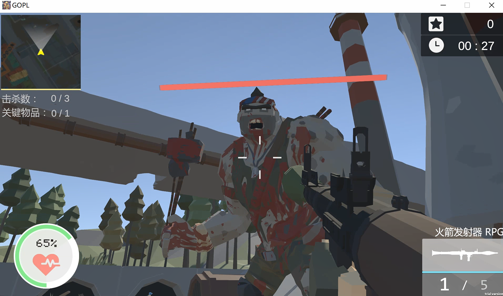
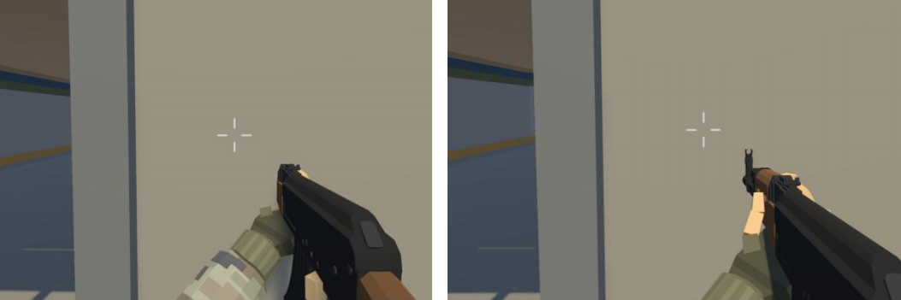
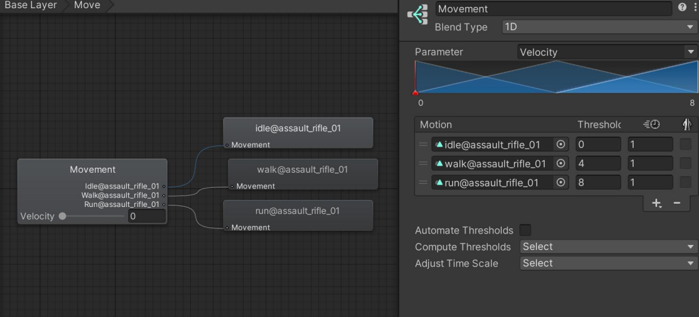
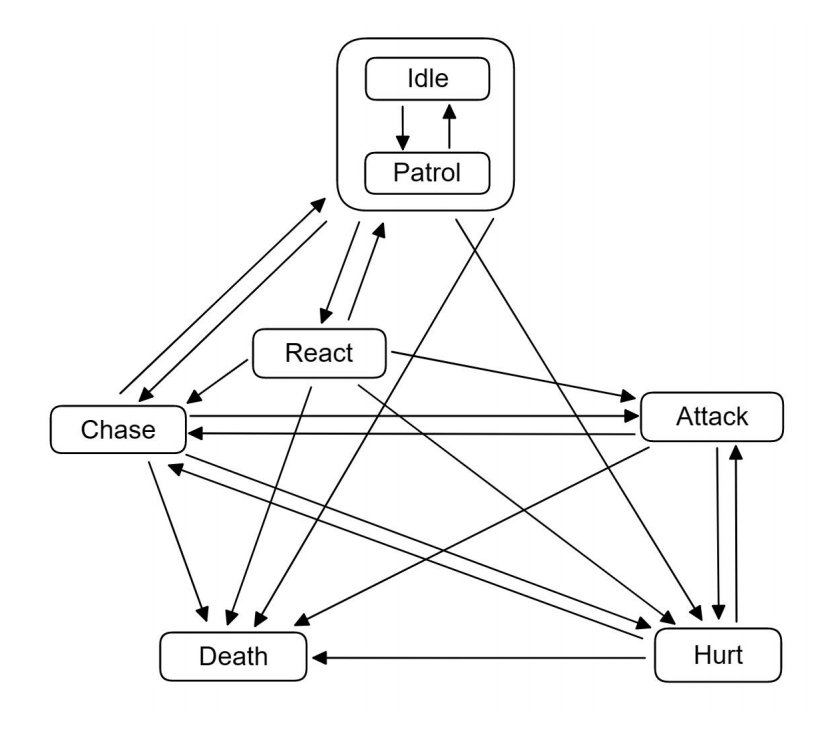
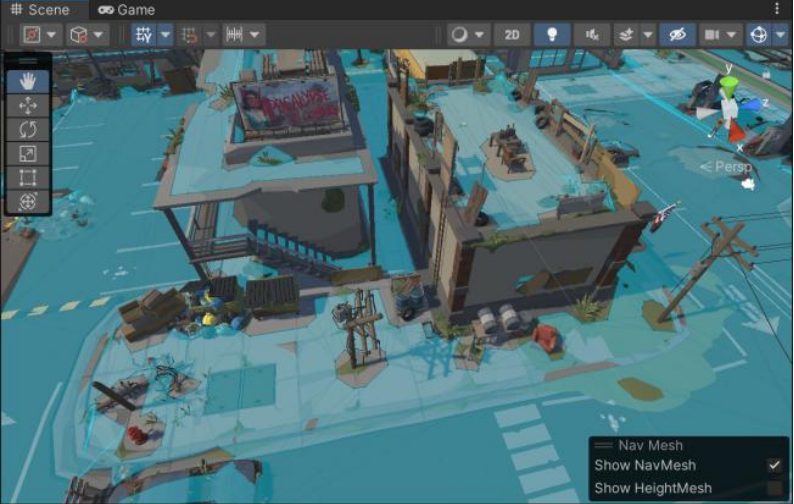
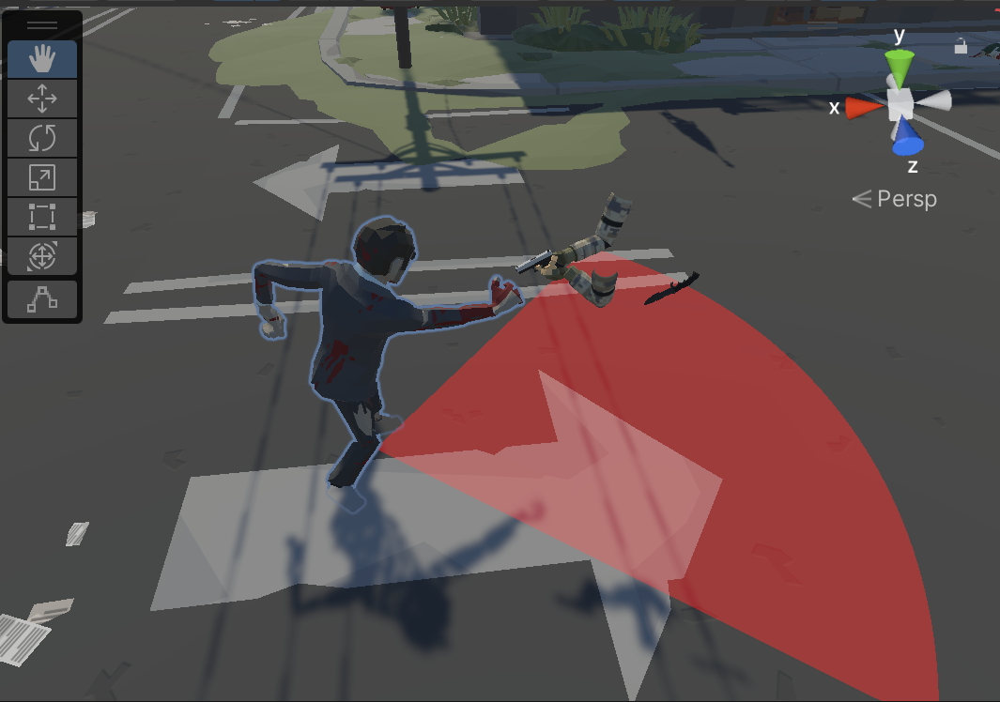
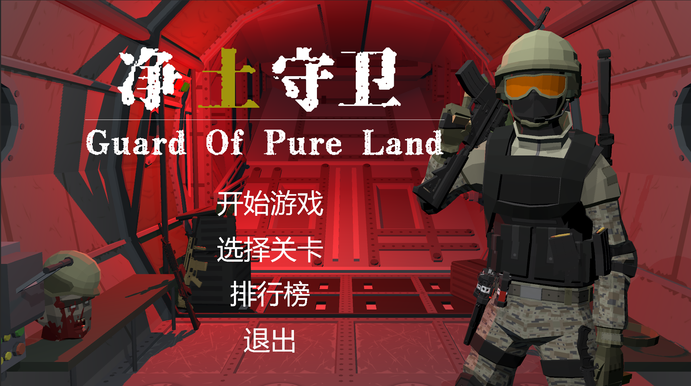
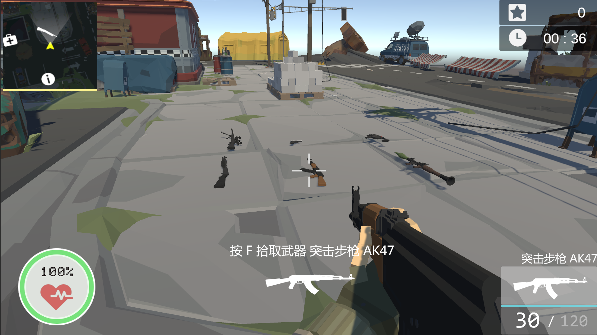
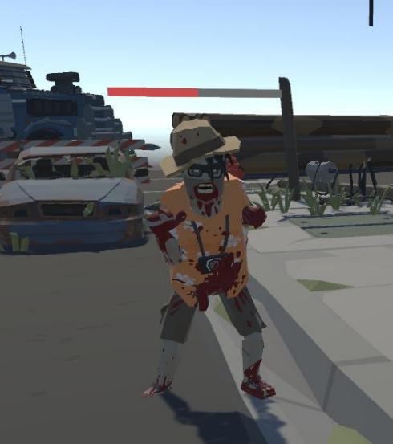

# GOPL
《净土守卫》（Guard Of Pure Land）——一个基于Unity3D开发的FPS游戏项目

本项目仅供游戏开发初学者学习使用

## 操作键位

- 移动：WASD
- 视角移动：鼠标移动
- 奔跑：Shift
- 跳跃：空格
- 蹲下：C
- 开火：鼠标左键
- 进入瞄准：鼠标右键
- 切换武器：数字键1和2或鼠标滚轮
- 武器检视：T
- 近战：E
- 投掷手雷：鼠标中键或G
- 与场景中物体互动：F
- 暂停：ESC

## 第一人称控制

将相机绑定在人物模型的头部位置，读取用户鼠标移动量并作为相机或人物GamObject的角度变化量，最后限制转动的上下限角度，最终实现第一人称视角的控制。

由于使用单Camera渲染的话会导致左图所示的枪械穿模问题，故使用Main Camera和Gun Camera分别渲染场景与持枪的手臂，最后叠加在一次呈现出最终画面，方可解决穿模问题（如右图）。

对于人物移动时的手部动作，会根据移动速度来渐进变化，主要体现变化为空闲->行走->奔跑三个与移动速度相关的状态的转换，使用了Blend Tree来实现这个过渡转变，动画更加丝滑与自然。

## 射击反馈

为了模拟真实的射击手感，实现了以下效果

- 后坐力
- 屏幕/视角震动
- 子弹散射
- 武器惯性摆动
- 粒子特效
  - 弹壳抛出
  - 枪口火焰与火光
  - 击中物体产生火光并留下弹孔

## 枪械类型

本项目目前实现了以下枪械类型

- [x] 突击步枪（AK47、M4A1）
- [x] 手枪（GLOCK）
- [x] 冲锋枪（Vector）
- [x] 狙击枪（M24）
- [x] 霰弹枪（S1897）
- [x] RPG（火箭发射器）
- [ ] 榴弹发射器

## 敌人AI

### 敌人类型

- 低级丧尸
- 高级丧尸
- BOSS

### FSM

敌人有空闲、巡逻、察觉、追击、攻击、受伤、死亡多种状态，通过状态模式在代码层面实现有限状态机FSM，控制Animator中的State转换，让敌人在不同状态下实现不同的行为。以下是敌人的状态转换图：

### 自动寻路

在把场景中的处于行走区域的物体设置为*Navigation Static*后，在*Window -> AI -> Navigation*面板进行参数设置并点击*Bake*后即可对地图中的可行走场景进行烘焙，Unity编辑器默认会以蓝色区域进行标注。而敌人在加上*Nav Mesh Agent*组件便可以用脚本控制其自动导航至指定目的地，从而实现对玩家的跟随追踪、随机巡逻等功能。

### 攻击检测

原采用射线检测，后改为扇形范围检测。

## 可拾取物

游戏中实现了可拾取或交互的物品种类如下：

- [x] 武器
- [x] 生命恢复类物品
- [x] 弹药
- [x] 剧情关键道具
- [ ] 收集品

## 游戏UI

### 主菜单

### HUD

游戏主要实现了如上图的HUD显示，分别为：

- 小地图
- 玩家血量显示
- 得分与计时面板
- 当前持有武器信息
- 与场景中物体交互的提示

### 敌人血条

敌人头顶上有血条UI，始终正面朝向玩家，提示敌人剩余生命值。

### 其它

其它UI实现还有

- 暂停界面
- 关卡结算（成功/失败）界面
- 排行榜